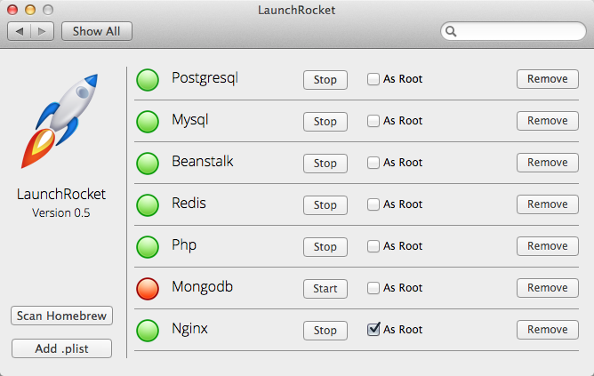

# Mac PreferencePane for Homebrew and launchd/launchctl

Opening a new tab in your Terminal and remembering to run a service, or running all your services all the time cause you're like, "Meh, I code all the time so...," what's the difference, right?

Well LaunchRocket is a Mac PreferencePane that makes turning those services on/off easier by giving you a tucked away, easy to use UI for adding, scanning and managing your Homebrew and launchd/launchctl services.

[Check out the source on GitHub](https://github.com/jimbojsb/launchrocket).

---

Link: [https://github.com/jimbojsb/launchrocket](https://github.com/jimbojsb/launchrocket)

Tags: Homebrew, launchd/launchctl, Mac, OS X, PreferencePane
